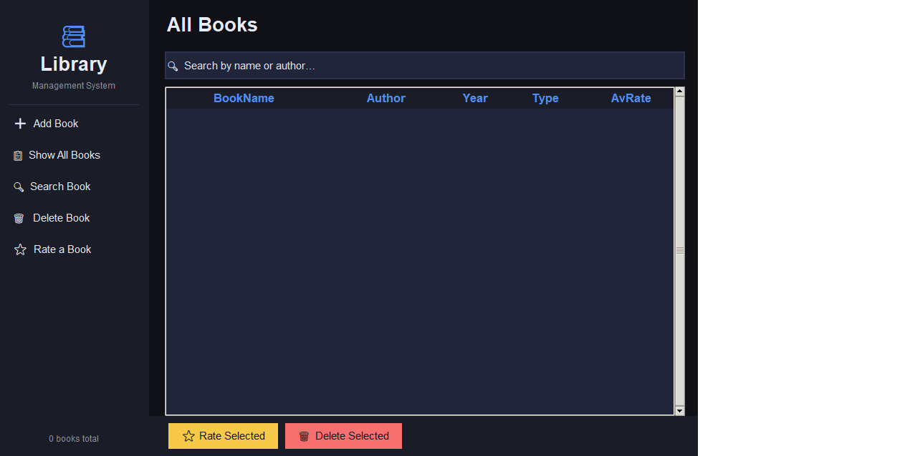
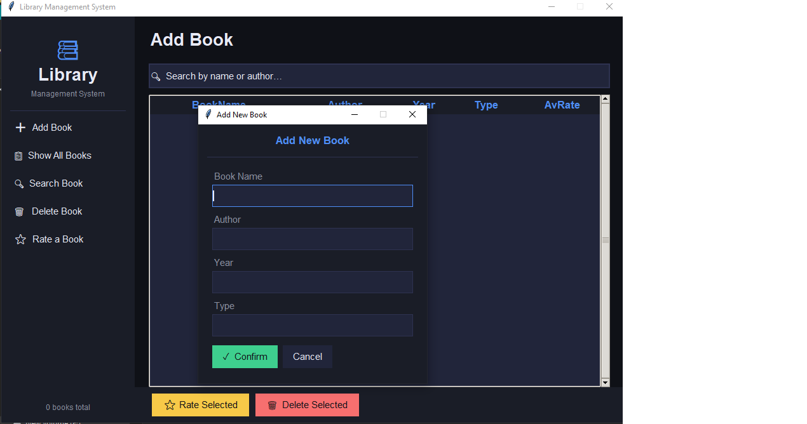
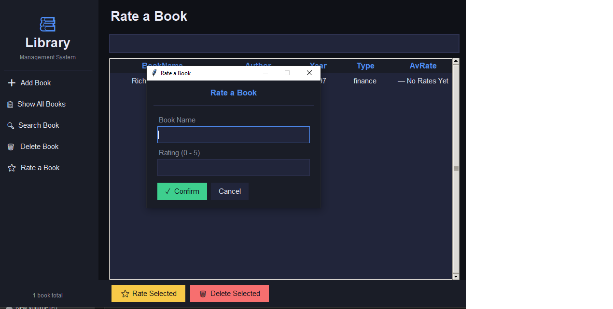

# 📚 Library Management System

**Library Management System** is a Python desktop app using **OOP** and **Tkinter**. It features a dual-layer architecture for efficient data handling and a sleek **Dark Mode** GUI. Key highlights include **inheritance**, **encapsulation**, and a dynamic book rating system for a professional user experience.

---

## 📸 Screenshots

| **Main Dashboard** | **Add New Book** |
| :---: | :---: |
|  |  |

| **Rating System** |
| :---: |
|  |

---

## ✨ Features

* **Dynamic Catalog Management**: Easily add, search, and delete books.
* **Interactive Rating System**: Users can rate books (0-5), and the system automatically updates the average score.
* **Real-Time Search**: Filter the book collection by title or author as you type.
* **Modern Dark UI**: A custom-styled interface with hover effects and organized data tables (Treeview).
* **Robust Logic**: Implements duplicate checking and input validation for data integrity.

---

## 🛠️ Technical Stack & Concepts

### Backend Architecture (OOP)
* **Inheritance**: The `Books` class inherits from `Library` to extend functionality.
* **Encapsulation**: Protected members (e.g., `_books`, `_ratings`) ensure data privacy.
* **Search Algorithm**: Efficient, case-insensitive search for book retrieval.

### Frontend (GUI)
* **Tkinter & Ttk**: Advanced UI components and layout management.
* **Event-Driven Programming**: Dynamic UI updates linked to backend logic.

---

## 🚀 Getting Started

1. **Clone the project**:
   ```bash
   git clone [https://github.com/yourusername/Library-Management-System.git](https://github.com/yourusername/Library-Management-System.git)
